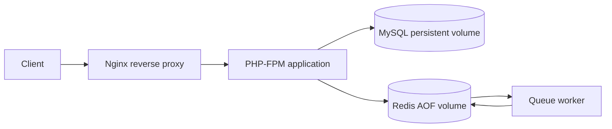

# Production Docker Stack Reference

Reproducible Docker Compose reference stack for a PHP application boundary, Nginx reverse proxy, MySQL, Redis, and a queue worker.

This is an original infrastructure example. It uses local-only example credentials and synthetic application responses; it is not a production deployment and contains no employer or customer material.

## Architecture



## Services

| Service | Responsibility | Health/restart behaviour |
| --- | --- | --- |
| `nginx` | Public HTTP boundary and FastCGI proxy | HTTP health check; `unless-stopped` |
| `app` | PHP-FPM runtime and sample application endpoint | FPM socket health check; `unless-stopped` |
| `worker` | Redis blocking queue consumer example | Restarts after process failure |
| `mysql` | Relational database with persistent volume | `mysqladmin ping` health check |
| `redis` | Queue/cache boundary with AOF persistence | `redis-cli ping` health check |

## Key Features

- Compose service dependency conditions based on health, not only container start order.
- PHP-FPM behind Nginx rather than exposing the application runtime directly.
- Separate worker process consuming a Redis list with blocking-pop semantics.
- MySQL and Redis named volumes for local persistence.
- Environment variables supplied through `.env`; `.env` is ignored by Git.
- Safe local-only defaults in `.env.example`; replace them before any shared environment.
- Nginx denies dot-files and exposes only the application public directory.
- Health checks and a repeatable HTTP smoke script.
- Least-privilege read-only volume mounts for Nginx configuration and public app files.

## Running Locally

```bash
cp .env.example .env
docker compose up --build -d
./scripts/smoke.sh
docker compose ps
```

The sample endpoint is available at [http://localhost:8080/](http://localhost:8080/) and the health endpoint at [http://localhost:8080/healthz.php](http://localhost:8080/healthz.php).

To enqueue a demonstration worker job:

```bash
docker compose exec redis redis-cli LPUSH reference_jobs "demo-job-1"
docker compose logs worker
```

Stop the stack without deleting named volumes:

```bash
docker compose down
```

Remove local database/cache volumes only when intentionally resetting local state:

```bash
docker compose down -v
```

## Configuration

`.env.example` documents the local variables. Do not commit `.env`, production credentials, certificates, or database dumps. In a real deployment, source secrets from a managed secret store and use a private network for MySQL and Redis.

## Reliability and Operations

- `depends_on` waits for MySQL/Redis health before starting dependent services.
- `restart: unless-stopped` handles process crashes but is not a substitute for orchestration.
- Named volumes preserve local state across ordinary `down`/`up` cycles.
- Redis AOF is enabled for the reference queue boundary.
- Health checks detect process/service readiness, not business correctness.
- Logs are emitted to container stdout/stderr so a runtime can collect them.

## Security Boundaries

Implemented in this reference:

- `.env` ignored and example values clearly local-only.
- Nginx dot-file denial.
- Nginx/app separation with PHP-FPM not published to the host.
- Read-only Nginx mounts.
- No credentials, private keys, customer data, or proprietary code.

Not claimed: TLS termination, WAF, network policy, image signing, runtime sandboxing, production backup policy, or secret-manager integration. Those depend on the target hosting environment.

## Validation

```bash
docker compose config
sh -n scripts/smoke.sh
php -l app/public/index.php
php -l app/healthz.php
php -l app/worker.php
```

The GitHub Actions workflow validates Compose configuration, shell syntax, and PHP syntax. A full container smoke test can be enabled on a runner with Docker service support.

## Engineering Decisions

- **Compose first:** keeps the service graph inspectable for local development and review.
- **Separate worker:** makes asynchronous work visible and independently restartable.
- **Health-gated dependencies:** reduces startup races without implying full orchestration semantics.
- **No fake production claims:** the README distinguishes implemented local behaviour from deployment controls that still require an operator.

## Future Improvements

- Add a production-like TLS/reverse-proxy profile without committing certificates.
- Add image vulnerability scanning and digest pinning in CI.
- Add backup/restore automation for MySQL and Redis persistence.
- Add resource limits, log rotation, and deployment examples for a target platform.
- Replace the sample worker job with a framework queue adapter from the Laravel reference project.

## License

MIT. See [LICENSE](LICENSE).
